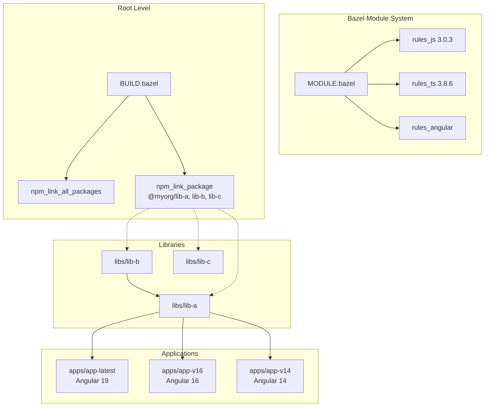
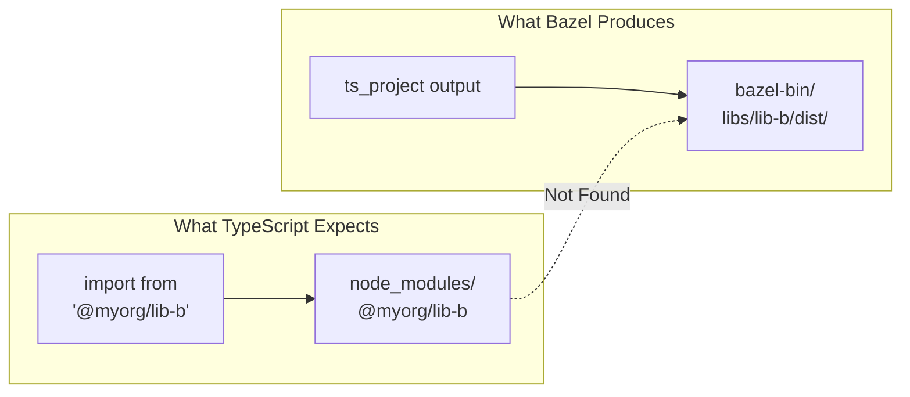
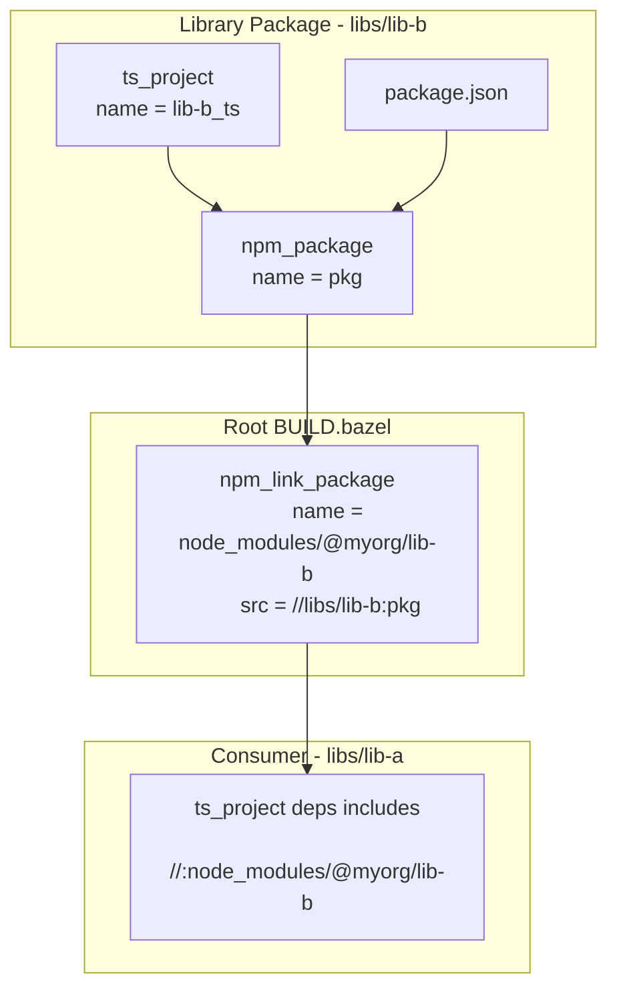
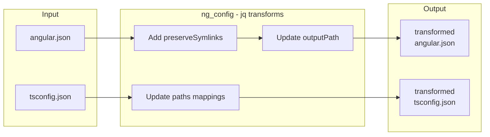
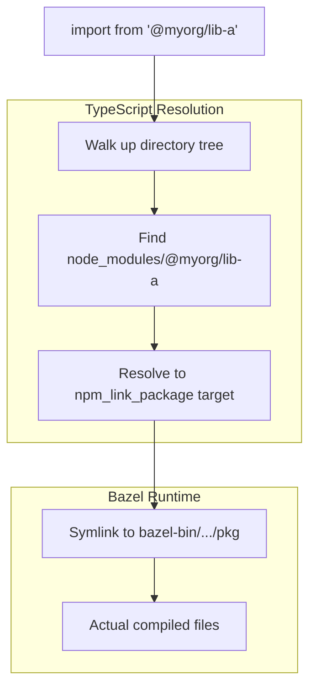

# Bazel Integration with rules_js, rules_ts, and rules_angular

This document explains all modifications required to build this monorepo with Bazel, including the challenges encountered and solutions implemented.

## Table of Contents

1. [Architecture Overview](#architecture-overview)
2. [Module Configuration](#module-configuration)
3. [First-Party Package Resolution](#first-party-package-resolution)
4. [Library BUILD Files](#library-build-files)
5. [Angular App BUILD Files](#angular-app-build-files)
6. [The preserveSymlinks Question](#the-preservesymlinks-question)
7. [Known Limitations](#known-limitations)

---

## Architecture Overview



---

## Module Configuration

### MODULE.bazel

The key dependencies and their versions:

```starlark
bazel_dep(name = "aspect_rules_js", version = "3.0.3")
bazel_dep(name = "aspect_rules_ts", version = "3.8.6")
bazel_dep(name = "aspect_bazel_lib", version = "2.22.5")
bazel_dep(name = "rules_nodejs", version = "6.7.3")

# rules_angular is not in BCR, so we use git_override
bazel_dep(name = "rules_angular")
git_override(
    module_name = "rules_angular",
    remote = "https://github.com/angular/rules_angular.git",
    commit = "2d6de06a64f559d115ea019923561690484677cc",
)
```

### Key Modifications

| Change | Reason |
|--------|--------|
| `aspect_bazel_lib@2.22.5` | Version 3.x not yet in BCR |
| `rules_nodejs@6.7.3` | Resolves version mismatch warnings |
| `git_override` for rules_angular | Not published to BCR yet |

### pnpm Integration

```starlark
pnpm = use_extension("@aspect_rules_js//npm:extensions.bzl", "pnpm")
pnpm.pnpm(
    name = "pnpm",
    pnpm_version = "10.13.1",
)

npm = use_extension("@aspect_rules_js//npm:extensions.bzl", "npm")
npm.npm_translate_lock(
    name = "npm",
    pnpm_lock = "//:pnpm-lock.yaml",
)
```

---

## First-Party Package Resolution

This was the most significant challenge. The problem: TypeScript looks for `@myorg/lib-b` in `node_modules`, but Bazel outputs are in `bazel-bin`.

### The Problem Visualized



### The Solution



### Root BUILD.bazel

```starlark
load("@aspect_rules_js//npm:defs.bzl", "npm_link_package")
load("@npm//:defs.bzl", "npm_link_all_packages")

# Link all third-party packages from pnpm
npm_link_all_packages(name = "node_modules")

# Link first-party packages at root level
# This is CRITICAL - they must be at the root for TypeScript resolution
npm_link_package(
    name = "node_modules/@myorg/lib-a",
    src = "//libs/lib-a:pkg",
    package = "@myorg/lib-a",
    visibility = ["//:__subpackages__"],
)

npm_link_package(
    name = "node_modules/@myorg/lib-b",
    src = "//libs/lib-b:pkg",
    package = "@myorg/lib-b",
    visibility = ["//:__subpackages__"],
)

npm_link_package(
    name = "node_modules/@myorg/lib-c",
    src = "//libs/lib-c:pkg",
    package = "@myorg/lib-c",
    visibility = ["//:__subpackages__"],
)
```

### Why Root Level?

TypeScript's module resolution walks up the directory tree looking for `node_modules`. By placing `npm_link_package` at the root, we ensure:

1. Any package in the repo can import `@myorg/lib-*`
2. The symlink structure matches what TypeScript expects
3. Bazel's dependency graph is correctly wired

---

## Library BUILD Files

### Pattern for Each Library

```starlark
load("@aspect_rules_js//npm:defs.bzl", "npm_package")
load("@npm//:defs.bzl", "npm_link_all_packages")
load("@aspect_rules_ts//ts:defs.bzl", "ts_project")

# Link this package's node_modules
npm_link_all_packages(name = "node_modules")

# Compile TypeScript
ts_project(
    name = "lib-b_ts",
    srcs = glob(
        ["src/**/*.ts"],
        exclude = ["src/**/*.d.ts"],  # Exclude .d.ts to avoid input/output collision
    ),
    declaration = True,
    declaration_map = True,
    source_map = True,
    out_dir = "dist",      # Must match tsconfig
    root_dir = "src",      # Must match tsconfig
    tsconfig = "tsconfig.json",
    deps = [
        ":node_modules/@types/lodash",
        ":node_modules/lodash",
        ":node_modules/rxjs",
        ":node_modules/tslib",  # Required for rxjs in esbuild
    ],
)

# Wrap as npm package (CRITICAL for first-party resolution)
npm_package(
    name = "pkg",
    srcs = [
        "package.json",    # Include package.json for proper npm package structure
        ":lib-b_ts",       # Include compiled output
    ],
    package = "@myorg/lib-b",
    visibility = ["//visibility:public"],
)
```

### Key Modifications Summary

| Modification | File | Reason |
|--------------|------|--------|
| `exclude = ["src/**/*.d.ts"]` | ts_project srcs | Prevents "file is both input and output" error |
| `out_dir = "dist"` | ts_project | Matches tsconfig.json outDir |
| `root_dir = "src"` | ts_project | Matches tsconfig.json rootDir |
| `npm_package` wrapper | BUILD.bazel | Creates proper npm package structure for linking |
| `tslib` dependency | ts_project deps | Required by rxjs when bundled with esbuild |

### Library with First-Party Dependency

```starlark
# libs/lib-a depends on libs/lib-b
ts_project(
    name = "lib-a_ts",
    # ... other config ...
    data = ["//:tsconfig_base"],  # For extends in tsconfig.json
    deps = [
        ":node_modules/@types/lodash",
        ":node_modules/lodash",
        ":node_modules/rxjs",
        ":node_modules/tslib",
        "//:node_modules/@myorg/lib-b",  # First-party dep from root
    ],
)
```

---

## Angular App BUILD Files

### Using rules_angular

```starlark
load("@npm//:defs.bzl", "npm_link_all_packages")
load("@rules_angular//src/architect:ng_application.bzl", "ng_application")
load("@rules_angular//src/architect:ng_config.bzl", "ng_config")

npm_link_all_packages(name = "node_modules")

# Transform angular.json and tsconfig.json for Bazel
ng_config(
    name = "ng_config",
)

# Build the Angular application
ng_application(
    name = "build",
    node_modules = ":node_modules",
    ng_config = ":ng_config",
    project_name = "app-latest",
    srcs = glob(
        ["src/**/*", "public/**/*"],
        exclude = ["**/*.spec.ts"],
    ),
    args = ["--configuration=development"],
    deps = [
        ":node_modules/lodash",
        ":node_modules/@types/lodash",
        ":node_modules/zone.js",
        ":node_modules/typescript",
        "//:node_modules/@myorg/lib-a",  # First-party libraries
        "//:node_modules/@myorg/lib-b",
    ],
    visibility = ["//visibility:public"],
)
```

### What ng_config Does



---

## The preserveSymlinks Question

### What rules_angular Does by Default

The `ng_config` macro injects `preserveSymlinks: true` into angular.json:

```javascript
// JQ transform in ng_config.bzl
.value.architect.build.options.preserveSymlinks = true
```

### Our Finding: It's Not Required!

We created a test without `preserveSymlinks` and the build succeeded:

```starlark
# Custom ng_config WITHOUT preserveSymlinks
ng_config_no_symlinks(
    name = "ng_config_no_symlinks",
)

ng_application(
    name = "build_no_symlinks",
    ng_config = ":ng_config_no_symlinks",
    # ... rest same as regular build
)
```

**Result:** Build succeeds with correct lodash version isolation:
- App: 4.17.20 ✓
- lib-a: 4.17.21 ✓
- lib-b: 4.17.15 ✓

### Why It Works Without preserveSymlinks



The npm_package + npm_link_package pattern creates a proper package structure that TypeScript can resolve without needing to follow symlinks to their real paths.

---

## Known Limitations

### Windows Path Length (Angular 14/16)

```
ERROR: tar.exe: could not chdir to 'bazel-out/x64_windows-fastbuild/bin/
node_modules/.aspect_rules_js/@babel+plugin-bugfix-safari-id-destructuring-
collision-in-function-expression@7.27.1_@babel+core@7.22.9/node_modules/
@babel/plugin-bugfix-safari-id-destructuring-collision-in-function-expression'
```

**Cause:** @babel package paths exceed Windows MAX_PATH (260 characters)

**Affected:** Angular 14 and 16 (they use @babel/preset-env with long package names)

**Not Affected:** Angular 19 (uses newer build system without these packages)

**Workarounds:**
1. Enable Windows long paths (requires admin + registry change)
2. Use shorter workspace path (e.g., `C:\r\`)
3. Use WSL2 or Linux

### Summary Table

| Component | Status | Notes |
|-----------|--------|-------|
| TypeScript libraries | ✅ Working | All libs build correctly |
| Angular 19 (app-latest) | ✅ Working | With or without preserveSymlinks |
| Angular 16 (app-v16) | ❌ Windows path issue | Works on Linux/macOS |
| Angular 14 (app-v14) | ❌ Windows path issue | Works on Linux/macOS |
| Lodash version isolation | ✅ Working | Each package gets its own version |
| rxjs peer dependency | ✅ Working | Shared correctly across packages |

---

## File Changes Summary

| File | Change Type | Purpose |
|------|-------------|---------|
| `MODULE.bazel` | Modified | Add rules_angular, fix versions |
| `BUILD.bazel` (root) | Modified | Add npm_link_package for first-party libs |
| `.bazelignore` | Modified | Ignore nested node_modules |
| `libs/*/BUILD.bazel` | Modified | Add npm_package wrapper, fix ts_project config |
| `libs/*/package.json` | Modified | Add tslib dependency |
| `apps/*/BUILD.bazel` | Modified | Use rules_angular ng_application |
| `apps/app-latest/ng_config_no_symlinks.bzl` | Added | Test build without preserveSymlinks |

---

## Quick Reference

### Build Commands

```bash
# Build all libraries
bazel build //libs/...

# Build Angular 19 app
bazel build //apps/app-latest:build

# Build without preserveSymlinks (test)
bazel build //apps/app-latest:build_no_symlinks

# Clean build
bazel clean && bazel build //apps/app-latest:build
```

### Verify Version Isolation

```bash
# Check lodash versions in bundle
grep -o "VERSION.*4\.17\.[0-9]*" bazel-bin/apps/app-latest/dist/browser/main.js
```

Expected output:
```
VERSION7 = "4.17.20
VERSION7 = "4.17.21
VERSION7 = "4.17.15
```
